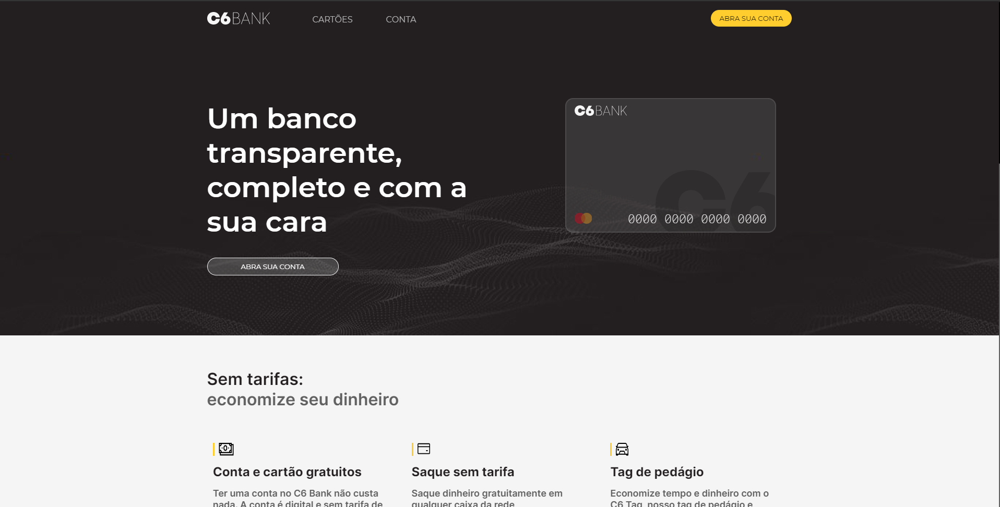

<h1 align="center">CLONE UI - C6 BANK</h1>

  

  <a href="https://c6-bank.vercel.app/">Deploy</a>

 

## 💻 Projeto

O C6 Bank é um banco digital brasileiro e apresenta uma UI muito bem pensada, por isso decidi fazer uma pegar alguns componentes e recriar a pagina Home, usando apenas HTML e SCSS puro.

## 🚀 Tecnologias

Esse projeto foi desenvolvido com as seguintes tecnologias:

- HTML.
- SCSS.
- JS.

## 🖌 Layout

- Layout WEB responsivo.

[Acessar Layout no Figma](https://www.figma.com/file/rDlr0tAUmht1g2YtALuh8k/Untitled?node-id=1%3A24)

## 🦾 Desafios

- Aplicar conceitos de UI.
- Utilizar o conceito de glass, que vem crecido muito dentro do mundo de UI.
- Fazer as animações mais fluidas possiveis.

Feito com ♥ by [Carlos Molmelstet](https://github.com/carlosmolmelstet)
